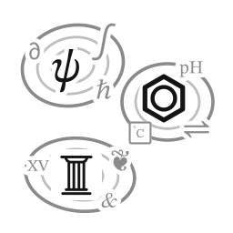
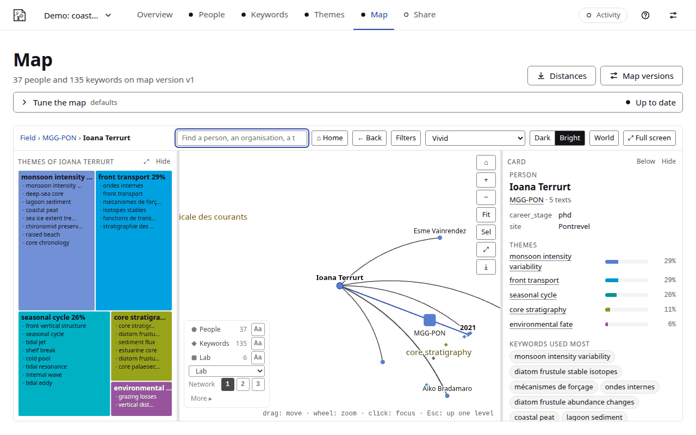

<p></p>

# cartolex

**cartolex maps a body of texts by the words of their authors.** Give it the
people of a field (a list, a laboratory, an institution): it collects their
texts from open services (OpenAlex, the ORCID registry, HAL…), finds the
vocabulary they actually use, places every person, organisation and text in a
lexical space, groups that vocabulary into themes and draws it all as an
atlas, which you explore in the app and share as a website that opens offline.

**Who talks the same.** Distances in the lexical space measure how much
people, teams or institutions talk the same about their subject, whether or
not they work together; the co-authorship network, drawn on the same map,
shows who does. The map shows what people write about, never how good their
work is. cartolex was made for research fields; any texts whose authors are
known will do, the articles of journalists for instance.

No programming is needed: everything happens in an app that runs in your web
browser, on your own computer. You check each step on screen: who is who,
which keywords count, what the themes are called.



## Download and install

### **[⬇ Download the installer: cartolex-installer.zip](https://github.com/cartolex/cartolex/releases/latest/download/cartolex-installer.zip)**

For everyone: no programming, no administrator rights. Linux and macOS
(version 1.0 does not run on Windows yet; a later 1.0 version will).

1. Click the link above: your browser saves `cartolex-installer.zip`.
2. Unzip it (double-click it in your Downloads folder).
3. In the folder that comes out, start the launcher of your system
   (a short guide in English, French and Portuguese sits beside it):
   - **macOS**: double-click `Install cartolex.command`. If macOS says the
     file « is damaged and can't be opened »: open Terminal, type `sh `
     (with a space), drag the file into the window and press Enter.
   - **Linux**: open a terminal in that folder and type
     `bash install-cartolex.sh`.
4. When it is done, open cartolex with the new shortcut (on the macOS
   desktop, in the Linux applications menu).

It installs everything in a `cartolex` folder of your home. To update,
download the installer again and run it again.

Not the green **Code** button of this page, nor the « Source code » archives of
the [releases page](https://github.com/cartolex/cartolex/releases/latest): those
are the program's sources, for developers. The installer is the file named
`cartolex-installer-<version>.zip` there, the same as the link above.

**With pip or uv**, for people at ease with a terminal (Python 3.10 to 3.14):

```bash
uv tool install cartolex          # or: python -m pip install cartolex
cartolex models add en fr         # the language models of your texts
cartolex                          # opens the app in your browser
```

Details and troubleshooting (« is damaged » on macOS, networks with a proxy):
[Installing cartolex](https://github.com/cartolex/cartolex/blob/main/docs/install.md).

## Your first map

The app opens on its Projects screen: press **Create the demo project** (an
invented community of coastal and marine scientists; nothing leaves your
computer), then **Build…** on the overview and **Build 9 stages**. A minute
later the map is there.
The tutorial [Your first map](docs/first-map.md) follows it step by step.

## Documentation

The documentation comes with the app: the **Documentation** button (the
question mark at the top of every screen) opens it for the version you run.
Its sources are in [docs/](docs/index.md):

- [What cartolex does, in its own words](docs/introduction.md): people, texts,
  keywords, themes, the map, the AI steps, sharing;
- tutorials: [your first map](docs/first-map.md),
  [map an institution](docs/tutorial-institution.md),
  [start from a list of names](docs/tutorial-names.md),
  [clean the keywords with an AI copilot](docs/tutorial-keywords.md),
  [shape the themes](docs/tutorial-themes.md),
  [explore the map](docs/tutorial-map.md), [share a site](docs/tutorial-share.md);
- guides: [collection](docs/collection.md), [keywords](docs/keywords.md),
  [the build](docs/build.md), [privacy](docs/privacy.md),
  [very large projects](docs/large-projects.md);
- [the method in one page](docs/about.md) and [its references](docs/references.md).

## Privacy

Everything stays on your computer. Only two steps reach the network, both said
before they start: the collection of publications (names and identifiers go to
the open bibliographic services) and the optional AI clean-up of the keywords
by API (keyword strings only, never texts or people). See
[Privacy and personal data](docs/privacy.md).

## Built on

[spaCy](https://spacy.io) and its language models find the noun phrases of
the texts (English, French, Portuguese, Spanish, German, Italian);
[scikit-learn](https://scikit-learn.org), [SciPy](https://scipy.org) and
[NumPy](https://numpy.org) weight them, build the lexical space and group the
themes; [UMAP](https://umap-learn.readthedocs.io) and
[openTSNE](https://opentsne.readthedocs.io) draw the map;
[OpenAlex](https://openalex.org) is the first source of texts. The methods
behind each step, with their references: [docs/references.md](docs/references.md).

## How to cite

cartolex is archived on Zenodo, one record per version, each with its DOI:
please cite the record of the version you used (the app's About page gives the
version). All versions: [doi:10.5281/zenodo.23223331](https://doi.org/10.5281/zenodo.23223331). [`CITATION.cff`](CITATION.cff) (« Cite this
repository » on GitHub) and [`codemeta.json`](codemeta.json) carry the
reference for reference managers; [How to cite](docs/cite.md) gives a BibTeX
entry, and [the references](docs/references.md) the methods to cite beside it.

## Authors and licence

cartolex is written by Elisa Klüger and Pierre Ronceray. It is free software
under the MIT licence: see [LICENSE](LICENSE).

## For developers

cartolex is a Python package (`cartolex.lexicon` and `cartolex.atlas` for the
engine, `cartolex.collect` for collection, `cartolex.project` and
`cartolex.build` for the project format and its build, `cartolex.app` for the
web app) with a command line that does everything the app does
([docs/dev/command-line.md](docs/dev/command-line.md)). Setting up, checking a
change, the corpus contract and the public programming interface are in
[CONTRIBUTING.md](CONTRIBUTING.md); the rules of the repository in
[AGENTS.md](AGENTS.md); the code's map in [ARCHITECTURE.md](ARCHITECTURE.md);
driving the engine from your own application in
[INTEGRATION.md](INTEGRATION.md); the changes of this release line in
[CHANGELOG.md](CHANGELOG.md).
